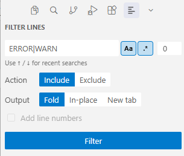
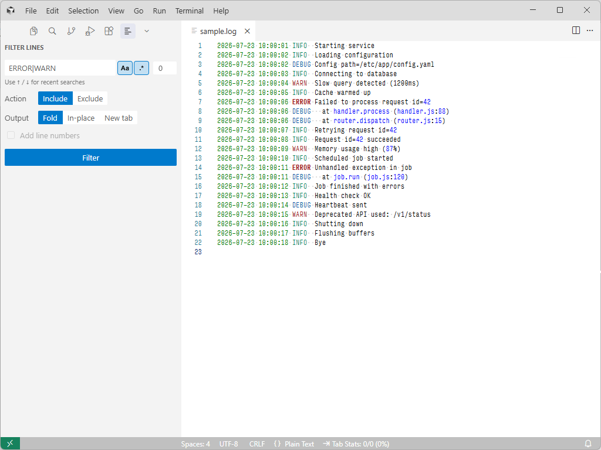
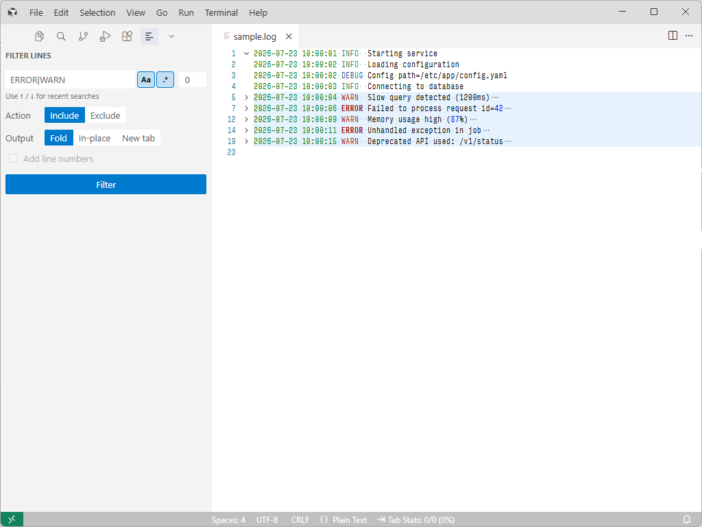
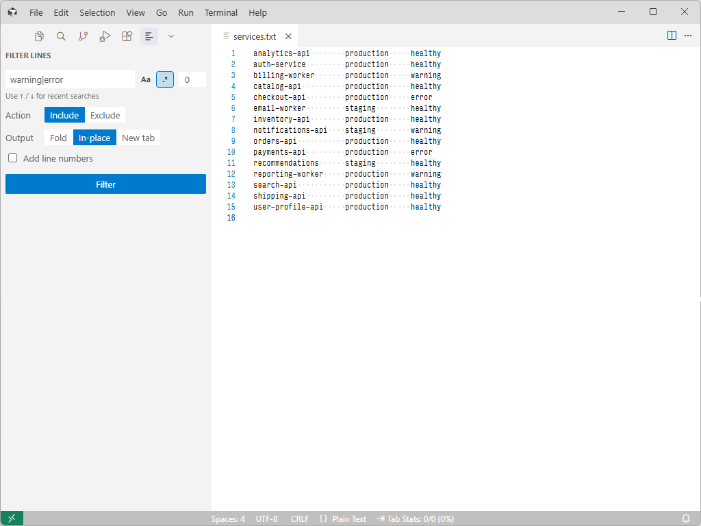
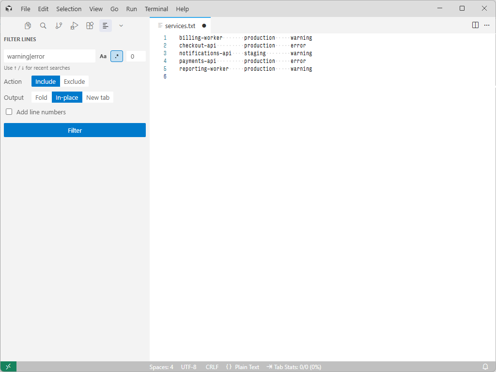
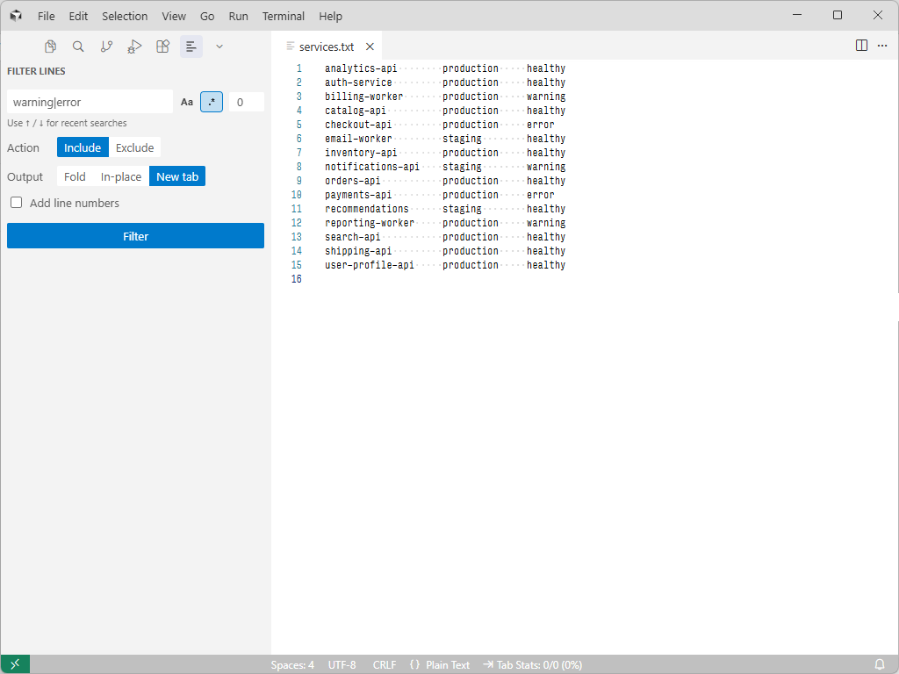
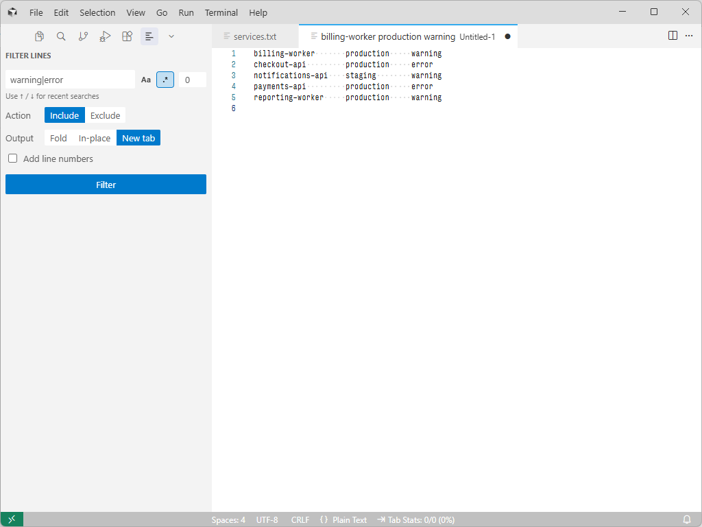
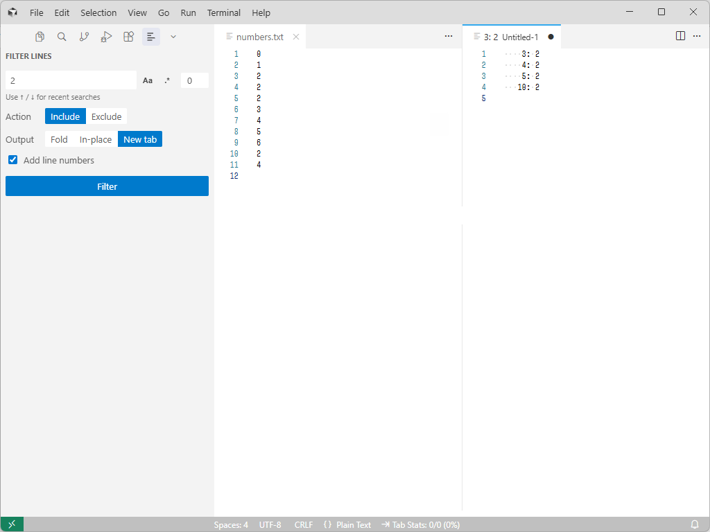

# Filter Lines

[](https://github.com/earshinov/vscode-filter-lines)
[](https://coveralls.io/github/earshinov/vscode-filter-lines?branch=master)

Filter lines of the current document by a string or a regular expression.

<!--
Intro GIF recording instructions:

Source and framing:
- Open doc/sample-files/sample.log in a single editor group.
- Show the Activity Bar, the complete Filter Lines view, and about 15-20 lines
  of the editor. Hide unrelated panels, notifications, and the minimap.
- Use a readable font size and keep the mouse still during each pause.

Prepare before recording:
- Restore sample.log and unfold all lines.
- Clear the search box.
- Select Include, enable .* and Aa, set Context to 0, and select Fold.
- Close the Filter Lines view so the recording starts with only sample.log.

Record:
1. Pause briefly on sample.log, then open Filter Lines from the Activity Bar.
2. Type ERROR|WARN and pause so the completed expression is readable.
3. Click Filter and end on the folded document with the configured Filter Lines
   view still visible.

Keep the finished GIF around 8-12 seconds. Trim idle time at the beginning and
end, but leave roughly one second after each result so the loop is easy to follow.
-->


## Quick start

1. Open the text file you want to filter.
2. Select 
   **Filter Lines** in the Activity Bar, or use **Command Palette** (`Ctrl-Shift-P`) → **Focus on Filter Lines View**.

<br>

<!--
Screenshot instructions:
- Open the Filter Lines view and enter ERROR|WARN.
- Enable .* and Aa; set Context to 0; select Include and Fold.
- Capture BEFORE filtering. Crop the image to the Activity Bar icon and the
  complete Filter Lines view.
- Save as media/screenshots/filter-lines-view.png; WELCOME.md reuses the same image.
-->


Filter Lines applies to the most recently focused text editor.

### Search

- **`Aa` — Match Case**
- **`.*` — Use Regular Expression** instead of literal text
- **Up / Down**: move backward or forward through the 20 most recent searches while the search box is focused
- **Enter**: run the filter without leaving the search box

### Action

- **Include** keeps matching lines
- **Exclude** keeps non-matching lines, like `grep -v`

**Context** (0 on the screenshot above) adds the specified number of lines before and after every kept line.
Overlapping context ranges are combined. With **Exclude**, context is applied to
the non-matching lines that remain, consistent with `grep -v -C`.

### Output

#### Fold

Leaves the document unchanged and folds lines outside the result.

<!--
Screenshot instructions:
- Use doc/sample-files/sample.log.
- Search ERROR|WARN with .* and Aa enabled, Context 0, Include, Fold.
- Capture BEFORE and AFTER filtering with the same crop. Include both the
  configured Filter Lines view and the editor.
- Save as media/screenshots/filter-lines-fold-before.png and
  media/screenshots/filter-lines-fold-after.png; WELCOME.md reuses both images.
-->

<p>
  
  
</p>

#### In-place

Replaces the current document with the result. Use Undo to restore it.

<!--
Screenshot instructions:
- Work on a copy of doc/sample-files/services.txt.
- Search warning|error with .* enabled and Aa disabled, Context 0, Include,
  In-place, and Add line numbers disabled.
- Capture a BEFORE/AFTER pair with the same crop. Include the complete Filter
  Lines view and editor in both images so it is clear that the current document
  was replaced.
- Save as media/screenshots/filter-lines-in-place-before.png and
  media/screenshots/filter-lines-in-place-after.png.
- Use Undo after the second screenshot.
-->

<p>
  
  
</p>

#### New tab

Opens the result in a new editor.

<!--
Screenshot instructions:
- Use doc/sample-files/services.txt.
- Search warning|error with .* enabled and Aa disabled, Context 0, Include,
  New tab, and Add line numbers disabled.
- Capture BEFORE and AFTER filtering with the same crop. Include the Filter Lines
  view and editor; the After image should show the newly opened result tab.
- Save as media/screenshots/filter-lines-new-tab-before.png and
  media/screenshots/filter-lines-new-tab-after.png.
-->

<p>
  
  
</p>

**Add line numbers** prefixes output lines with their original 1-based line
numbers, padded to five columns. It is available for In-place and New tab output.

<!--
Screenshot instructions:
- Use doc/sample-files/numbers.txt.
- Search 2 as literal text, Context 0, Include, New tab, and Add line numbers
  enabled.
- Capture AFTER filtering. Include the Filter Lines view and the numbered result
  in the newly opened tab.
- Save as media/screenshots/filter-lines-line-numbers.png.
-->



## Regular expressions

Filter Lines accepts JavaScript regular expressions and applies them to one line
at a time. See [MDN](https://developer.mozilla.org/en-US/docs/Web/JavaScript/Guide/Regular_Expressions)
for the syntax reference.

Enter only the expression itself, without JavaScript's enclosing slashes. For
example, use `ERROR|WARN`, not `/ERROR|WARN/`. Patterns cannot match across
multiple lines.

## Upgrading from 1.x

<!-- Keep this section in sync with "Upgrading from 1.x" in WELCOME.md. -->

Version 2 replaces the separate commands and prompt sequence with the Filter
Lines view:

- The eight variants of the Include / Exclude commands have been replaced by
  controls in the view.
- The old `filterlines.*` settings have been removed. Search type, case
  sensitivity, output mode, context, and line numbers are selected in the form
  and remembered automatically.
- The default `Ctrl-K Ctrl-R` and `Ctrl-K Ctrl-S` keybindings have been removed.
  You can assign a keybinding to **Focus on Filter Lines View** in Keyboard
  Shortcuts.
- The old New tab / In-place choice is now joined by **Fold**, which collapses
  irrelevant ranges without modifying the file.
- Indented context has been removed; consider using **Fold** mode instead.

## Programmatic use

Custom keybindings can invoke the `filterlines.filterLines` command with an
object containing any of these optional properties:

| Argument | Values | Default | Description |
|----------|--------|---------|-------------|
| `search_type` | `"regex"` or `"string"` | `"regex"` | Selects regular-expression or literal-string matching. |
| `invert_search` | `true` or `false` | `false` | Uses Exclude rather than Include behavior. |
| `needle` | string | `""` | Search expression or literal text. |
| `case_sensitive` | `true` or `false` | `true` for regex; `false` for string | Enables case-sensitive matching. |
| `context` | non-negative number | `0` | Adds this many lines before and after each kept line. |
| `output_mode` | `"fold"`, `"inplace"`, or `"newtab"` | `"newtab"` | Selects where and how the result is displayed. |
| `line_numbers` | `true` or `false` | `false` | Adds original line numbers to In-place or New tab output. |

Example keybinding with a fixed filter:

```json
{
  "key": "ctrl+k ctrl+e",
  "command": "filterlines.filterLines",
  "args": {
    "search_type": "regex",
    "needle": "ERROR|WARN",
    "case_sensitive": true,
    "context": 1,
    "output_mode": "fold"
  }
}
```

### Breaking changes since v1

- In the `filterlines.filterLines` command:

  - `before_context` and `after_context` options have been removed; use the symmetric
    `context` argument.
  - Extension settings no longer provide defaults for programmatic calls. Pass
    `case_sensitive`, `output_mode`, and `line_numbers` options explicitly when needed.

- The interactive commands have been removed:

  - `filterlines.includeLinesWithRegex`
  - `filterlines.includeLinesWithString`
  - `filterlines.excludeLinesWithRegex`
  - `filterlines.excludeLinesWithString`
  - `filterlines.includeLinesWithRegexAndContext`
  - `filterlines.includeLinesWithStringAndContext`
  - `filterlines.excludeLinesWithRegexAndContext`
  - `filterlines.excludeLinesWithStringAndContext`
  - `filterlines.promptFilterLines`

## About

Filter Lines v1 was originally based on the [Filter Lines](https://packagecontrol.io/packages/Filter%20Lines) extension for Sublime Text.

You can find Filter Lines both in the [Visual Studio Marketplace][] and in the [Open VSX Registry][].

[Visual Studio Marketplace]: https://marketplace.visualstudio.com/
[Open VSX Registry]: https://open-vsx.org/
